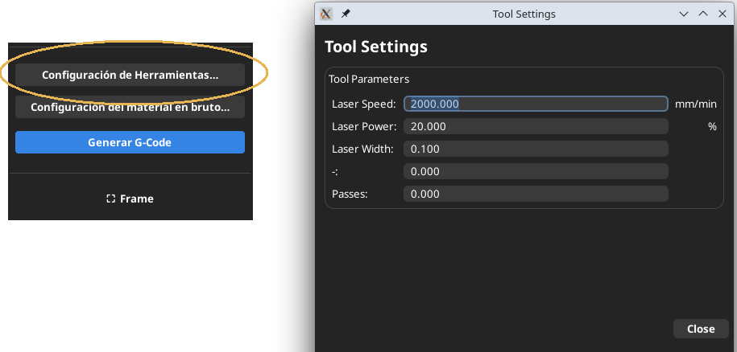
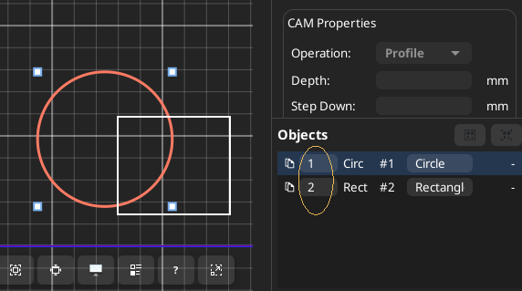
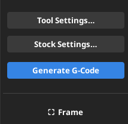

# Designer

Designer is used to create, edit, and import vector designs, as well as import images for engraving.

## Main Actions
- Draw primitives (rectangles, circles, lines, ellipses, polylines, triangles, polygons, pinions, gears)
- Add text
- Add images, even creating a composition of several images along with vector objects
- Independently define the engraving parameters for each image using its properties
- Define global parameters for vector objects that do not require independent parameters
- Independently define the parameters of each vector object using its properties
- Reorder objects in the Objects panel, which will be used for G-code generation
- Import DXF and SVG files

- Out of Bounds warning If any point goes outside the work area, an Out of Bounds warning will appear in the G-code so the user can determine what to do:
- Export to G-code or SVG
- Generate the frame for adjusting the material on the machine
- Generate the final G-code. When generating the G-code, you will be taken to the Viewer tab to check the result before running the job.

---
## Global Properties

Clicking the "Tool Settings" button opens the window for global job settings. This configuration will be used for all vector objects that have the "Use Global Values" checkbox selected in the "Laser Settings (Object)" object properties.

---
## Individual Object Properties Panel

In the right-hand panel, when an object is selected, its properties appear:
    <li>Position</li>
    <li>Size</li>
    <li>Rotation</li>
    <li>Corners (rounding)</li>
    <li>Geometric Operations (offset, fillet, chamfer)</li>
    <li>CAM Properties</li>
    <li>Individual Laser Settings (speed, power, and passes) of a given object</li>

---
## Objects Panel

The object panel displays the list of objects with:
    <li> Order Number</li>
    <li> Object Type (Rectangle, Circle, Path, etc.) and ID #</li>
    <li> Object Name</li>
    <li> The order number is editable and is used to organize the objects when generating G-code so that the objects are executed in that order.</li>
    <li> The name is also editable, so that the objects can be conveniently identified.</li>
    
<li> </li>

---
## Gcode and Frame Generator

- In the Designer's left panel are the "Generate G-Code" and "Frame" buttons. After completing the design, it's advisable to generate the job's perimeter so you can send it to the machine and center the material properly. Once this process is complete, return to the Designer to generate the G-Code using the button. Once generated, you'll automatically jump to the Visualizer tab to see how the job will be executed. Once satisfied, go to Machine Control to start the job.
---

## Related
[Visualizer](help:visualizer)
[Machine Control](help:machine_control)
[Index](help:index)
