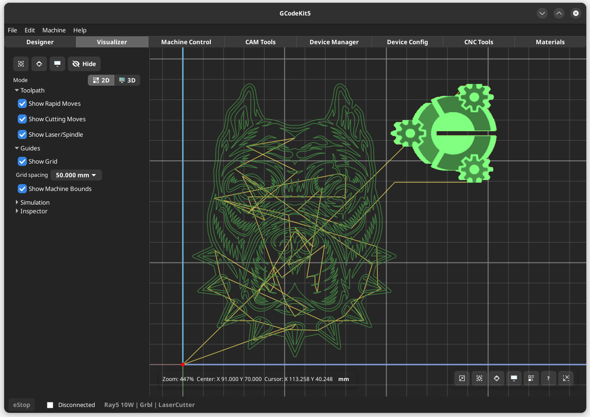

# Visualizador

El Visualizador muestra una vista previa de las trayectorias de la herramienta y (opcionalmente) los límites del área de trabajo de la máquina.

- Mostrar/Ocultar Movimientos rápidos
- Mostrar/Ocultar Movimientos de corte
- Mostrar/ocultar Herramienta
- Mostrar/ocultar Rejilla
- Mostrar/Ocultar Límites de Máquina

## Relacionado
[Preferencias](help:settings)
[Control de Máquina](help:machine_control)
[Índice](help:index)
